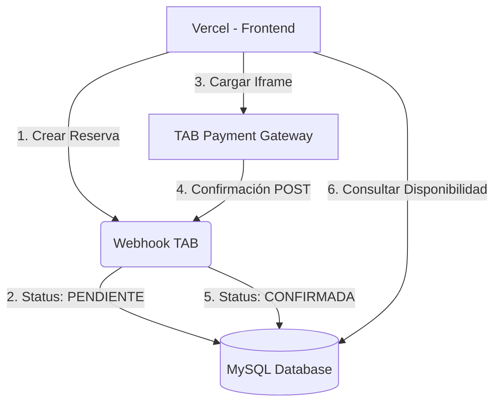

# Guía Técnica: Integración de Pagos con TAB (Gateway)

Esta guía detalla la arquitectura y el flujo de trabajo para implementar la pasarela de pagos TAB en el sistema de reservas del Hotel Cardenal.

## 1. Arquitectura del Sistema

Debido a que el frontend principal reside en **Vercel** (Serverless) y necesitamos una confirmación de pago 100% confiable, utilizaremos un **Servidor Puente** en cPanel.



## 2. Flujo de Implementación

### Paso 1: Creación de la Reserva (Frontend -> Backend Bridge)
Cuando el usuario completa sus datos en el Checkout (Vercel), el frontend realiza un `POST` al subdominio `api.hotelelcardenalloja.com`.

**Endpoint:** `POST /api/reservas`  
**Acción:** 
1. Recibe datos del huésped, fechas y total.
2. Inserta en la tabla `reservas` con `estado = 'PENDIENTE'`.
3. Retorna un `order_id` único.

### Paso 2: El Iframe de TAB
Con el `order_id` recibido, Vercel muestra el Iframe de TAB:

```html
<iframe 
  src="https://tab.com/pago?order_id=ORD-123&amount=120.00&currency=USD" 
  width="100%" 
  height="600">
</iframe>
```

### Paso 3: El Webhook de Confirmación (TAB -> Backend Bridge)
TAB enviará un POST al servidor en cPanel cuando el pago sea exitoso.

**Endpoint:** `POST /api/webhooks/tab`  
**Acción:**
1. Valida la firma de seguridad de TAB.
2. Busca la reserva con el `order_id`.
3. Cambia el estado en la base de datos de `PENDIENTE` a `CONFIRMADA`.

## 3. Sincronización de Disponibilidad

El sistema de habitaciones en Vercel ya está configurado para leer la tabla de reservas. 

### Lógica Automática:
*   **Habitación Ocupada:** Si existe una reserva con `estado != 'CANCELADA'` para las fechas consultadas, la habitación aparecerá automáticamente como **OCUPADA** en:
    *   El buscador de la página principal.
    *   El panel de administración (Dashboard).
*   **Reserva Pendiente:** Las reservas en estado `PENDIENTE` pueden configurarse para bloquear la habitación por un tiempo limitado (ej. 15 minutos) o liberarse si no llega el Webhook de TAB.

## 4. Requisitos para el Subdominio (cPanel)

El subdominio `api.hotelelcardenalloja.com` debe tener:
1.  **Node.js App** (o PHP) configurado para conectarse a la base de datos MySQL existente.
2.  **CORS Habilitado**: Para permitir que Vercel pueda enviar los datos de la reserva.
3.  **Certificado SSL (HTTPS)**: Obligatorio para recibir Webhooks de pasarelas de pago.

---

> [!IMPORTANT]
> Esta arquitectura garantiza que no se pierdan pagos debido a desconexiones del navegador o límites de tiempo de Vercel. La base de datos MySQL en cPanel actúa como el corazón que sincroniza el frontend, el administrador y el proceso de pago.
